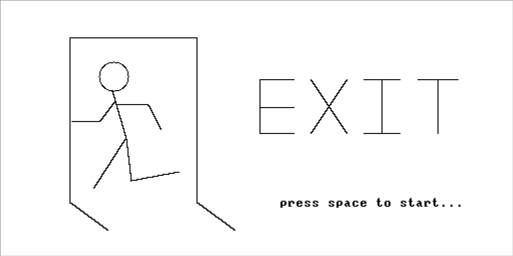
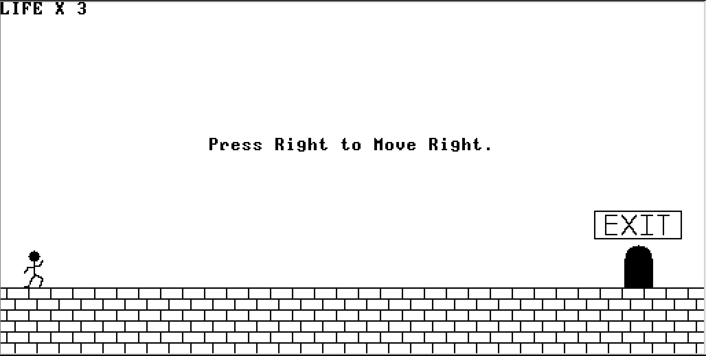
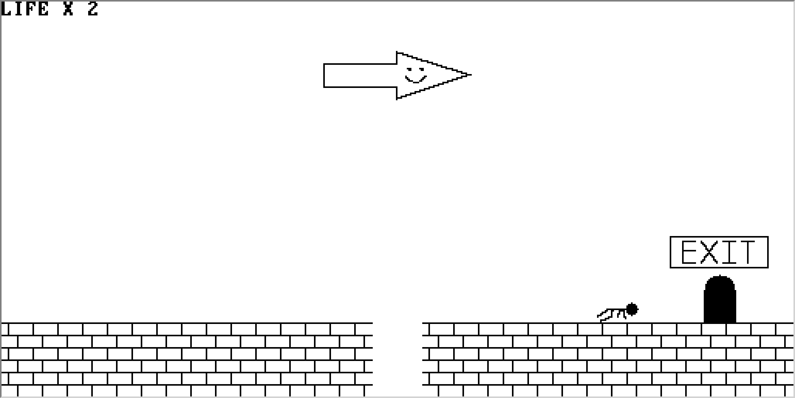
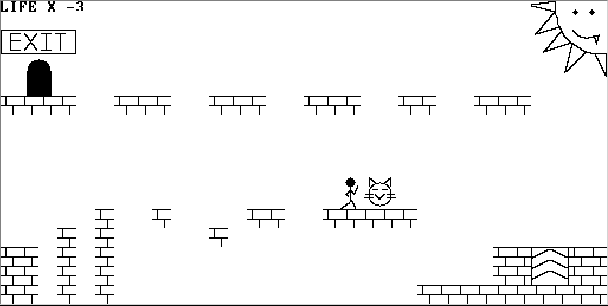
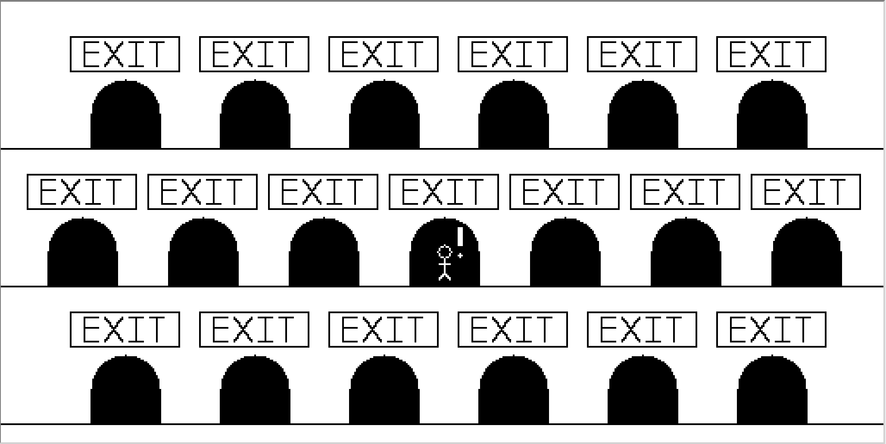

# EXIT

## Introduction
This is the final group project of "Introduction to Computer, Fall 2019". This game was inspired by "Cat Mario", which is a trolling version of Mario. The exit you see may not be real. The invisible traps on the way out may kill you, even the scene may kill you. Can you exit unscratched?

## Snapshots

## How to run
### Online IDE
You can run the project with the [online IDE](https://nand2tetris.github.io/web-ide/vm).

1. In the "VM Code" panel, click "Load files", "Select local file" and upload `exit/vm/`.
2. Set "Execution speed" to "Fast" and run.
3. In the "Screen" panel, enable keyboard. (You can click "x2" to scale up screen size.)
4. Enjoy the game!

### Desktop Version
1. Download [Java](https://www.java.com/en/download/).
2. Download [Nand2tetris Software Suite](https://www.nand2tetris.org/software).
3. Download this repository to your computer.
4. Run `nand2tetris/tools/VMEmulator.sh` (or `VMEmulator.bat` if you're using Windows).
5. In the VMEmulator, click "Load Program".
6. Select the `exit/vm/` (You have to load the whole directory!).
7. Set "Animate" to "No animation".
8. Click "Run".
9. Enjoy the game!

## How to compile
If the game is not working properly, you can compile the game on your own.

1. Compile the code repository with Nand2tetris JackCompiler.

    `$ ./nand2tetris/tools/JackCompiler.sh exit/code`

2. Replace all the vm files in exit/vm with the new ones.
3. Run the game as aboves.
